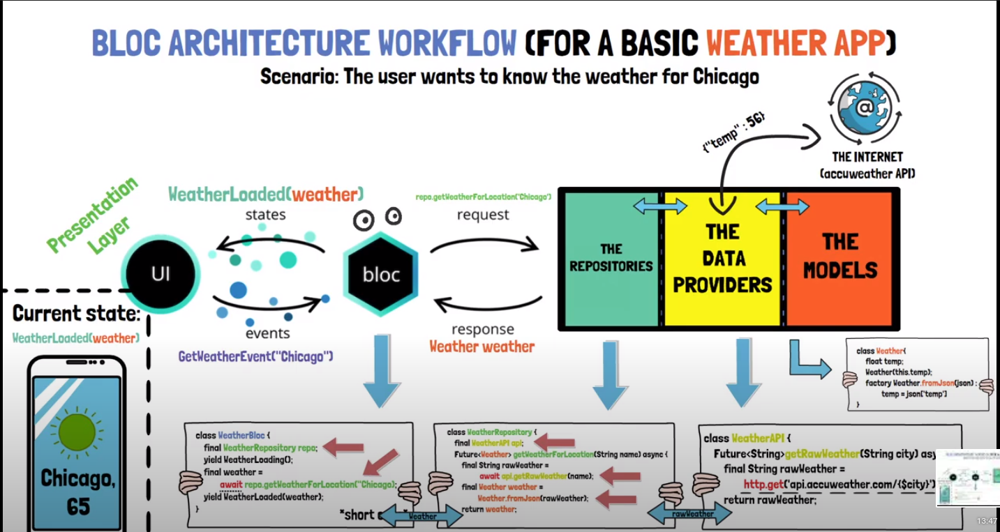

# BloC (Business Logic Component)

## O que é?

BLoC é a sigla para Business Logic Object Components, um padrão muito utilizado no Flutter e que causa muita confusão em relação ao seu conceito.

Na verdade, o BLoC nada mais é do que a separação das regras de negócio da sua interface.

## Quando utilizar?

O mais importante sobre conhecer padrões é saber quando utilizá-los, e com o BLoC não é diferente. O BLoC serve para separar a regra de negócio da interface, mas o que isto quer dizer?

Vamos imaginar que estejamos construindo uma aplicação que tenha duas interfaces, uma específica para Android e outra específica para iOS.

Embora as telas sejam diferentes, a regra de negócio por trás delas é a mesma, ou seja, a forma como o usuário fará login, os cálculos a serem executados, tudo isto, será _COMUM_ entre ambas interfaces.

Aqui entra a real necessidade do uso do BLoC, se você não tem duas interfaces distintas, se não precisa reusar suas regras em lugares diferentes, então você não precisa do BLoC.

Utilizar padrões desnecessariamente, causam o que chamamos de Overengeneering ou engenharia desnecessária, ele traz mais complexidade do que resolve problemas, ou seja, ao invés de ajudar, atrapalha.

## Cubit vs BloC

## Projetos

- counter_cubit
  > Criação de um contador com incremento e decremento utilizando Cubit
- counter_bloc

## Arquitetura Bloc

